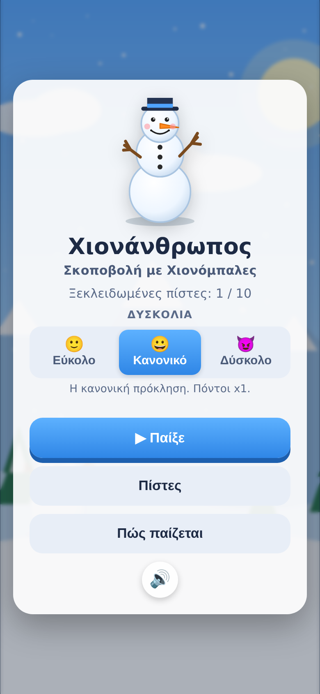
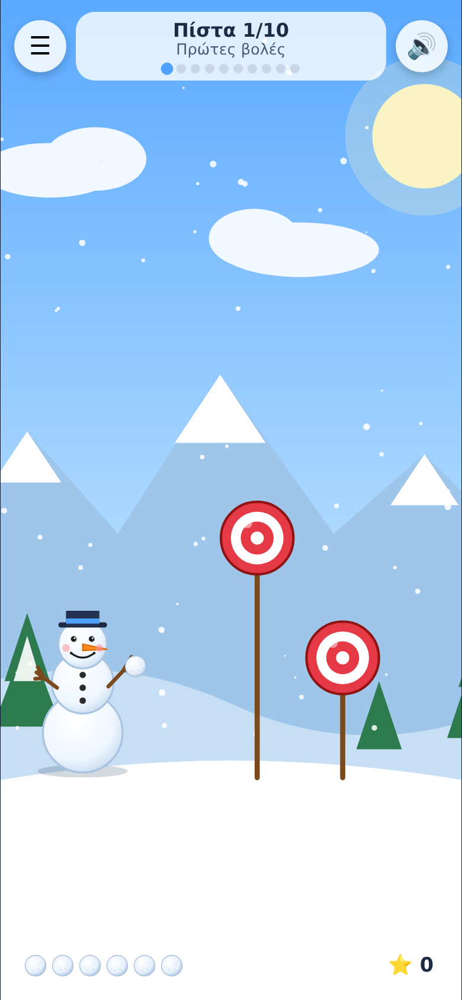
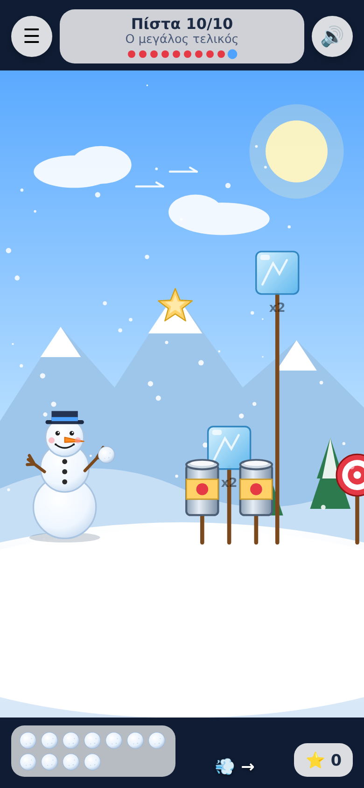
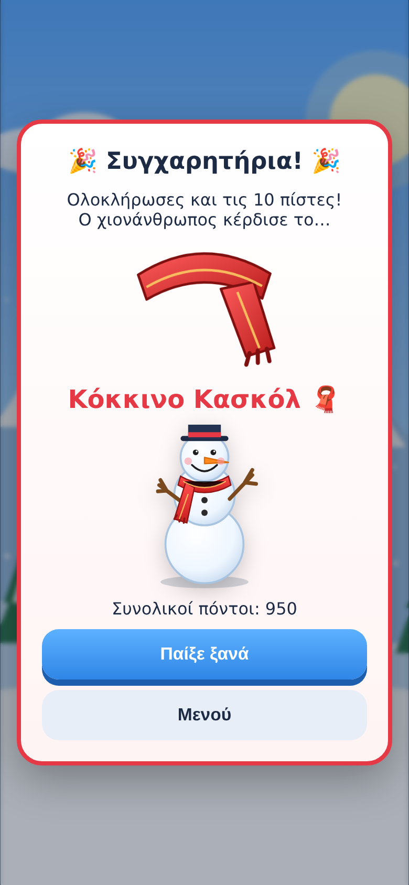

# ⛄ Χιονάνθρωπος: Σκοποβολή με Χιονόμπαλες

Παιχνίδι για κινητό (HTML5 / Canvas, PWA). Ο χιονάνθρωπος πετάει χιονόμπαλες σε
στόχους. Ολοκλήρωσε και τις **10 πίστες** για να κερδίσεις το **κόκκινο κασκόλ** 🧣.

## Πώς παίζεται

- Σύρε το δάχτυλο **προς τα πίσω** (σαν σφεντόνα) και άφησέ το για να πετάξεις.
- Πέτυχε **όλους** τους στόχους της πίστας πριν τελειώσουν οι μπάλες.
- 🎯 Στόχος 100 πόντοι · 🥫 Κονσέρβα 80 · 🧊 Παγάκι 150 (θέλει 2 χτυπήματα) · ⭐ Αστέρι 250.
- Κάθε μπάλα που περισσεύει στο τέλος της πίστας δίνει +50.
- Από την πίστα 5 υπάρχουν κινούμενοι στόχοι, από την 6 φυσάει αέρας 💨.
- Η πρόοδος (ξεκλείδωτες πίστες, ρεκόρ, κασκόλ) αποθηκεύεται στη συσκευή.

## Τρέξε το τοπικά

Χρειάζεται ένας απλός static server (τα ES modules δεν φορτώνουν από `file://`):

```bash
npx serve .            # μέσα στο site/snowman — ή: python3 -m http.server 8080
```

Άνοιξε τη διεύθυνση στο κινητό (ίδιο Wi-Fi) ή στον browser με device emulation.
Στο κινητό μπορείς να το «προσθέσεις στην αρχική οθόνη» και παίζει offline.

## Δομή

```
index.html            Οθόνες (μενού, πίστες, HUD, νίκη/ήττα, έπαθλο)
css/style.css         Στυλ για κινητό (safe areas, portrait)
js/main.js            Εκκίνηση
js/game.js            Μηχανή παιχνιδιού: φυσική, στόχευση, σύγκρουση, σχεδίαση
js/levels.js          Οι 10 πίστες (στόχοι, μπάλες, αέρας, κίνηση)
js/ui.js              DOM overlay (μενού, HUD, διάλογοι)
js/audio.js           Μουσική & ηχητικά εφέ (WebAudio, χωρίς αρχεία ήχου)
assets/sprites/*.svg  Sprites: χιονάνθρωπος (3 στάσεις), χιονόμπαλα, 4 στόχοι, κασκόλ, φόντο
assets/icons/         Εικονίδια PWA
../../tools/snowman-gemini-art.mjs  Παραγωγή εικονογραφήσεων με Gemini
sw.js, manifest.webmanifest    PWA / offline
```

## Αυτόνομο αρχείο (ένα HTML)

```bash
node tools/snowman-bundle.mjs            # από τη ρίζα του repo → dist/snowman.html
```

Ενσωματώνει CSS, JS και όλα τα sprites σε ένα αρχείο, για να στείλεις το
παιχνίδι ή να το ανοίξεις χωρίς server.

## Μουσική

Η χαρούμενη μελωδία (Ντο μείζονα, 132 BPM) και τα εφέ παράγονται σε πραγματικό
χρόνο με WebAudio (`js/audio.js`), άρα δεν υπάρχουν αρχεία ήχου να κατέβουν.
Ξεκινά με το πρώτο άγγιγμα (πολιτική autoplay των κινητών). Κουμπί σίγασης 🔊/🔇.

## Εικονογραφήσεις με Gemini

Τα sprites που περιλαμβάνονται είναι SVG σχεδιασμένα με κώδικα, ώστε το παιχνίδι
να δουλεύει άμεσα και offline. Για να τα αντικαταστήσεις με εικονογραφήσεις
Gemini:

```bash
export GEMINI_API_KEY=...                 # https://aistudio.google.com/apikey
node tools/snowman-gemini-art.mjs --apply   # από τη ρίζα του repo
# προαιρετικά: --only snowman,scarf   --model gemini-2.5-flash-image
```

Το script γράφει PNG στο `assets/sprites/gemini/` και με `--apply` γυρίζει τον
διακόπτη `USE_GEMINI_ART` στο `js/game.js`. Όποιο PNG λείπει, το παιχνίδι
χρησιμοποιεί αυτόματα το αντίστοιχο SVG. Οι prompts κρατούν σταθερό στυλ
(flat cartoon, διάφανο φόντο) και ίδια ονόματα με τα SVG για αντικατάσταση 1:1.

> Σημείωση: η παραγωγή εικόνων με Gemini χρεώνεται ανά εικόνα και τα
> αποτελέσματα διαφέρουν ανά εκτέλεση. Έλεγξε τις εικόνες πριν τις κάνεις commit.

## Στιγμιότυπα

| Μενού | Πίστα 1 | Πίστα 10 | Έπαθλο |
|---|---|---|---|
|  |  |  |  |
